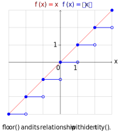
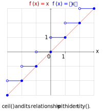
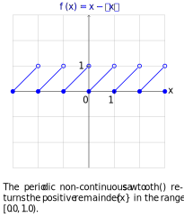
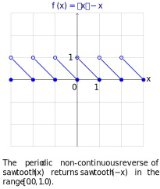

# periodic - exploring periodic coordinate systems and angles

**periodic** is a c++20 project that is for exploring things about periodic coordinate systems, especially thinking about angles.

## Topics Of Interest

### Periodic Coordinate Systems
3D linear spatial coordinate systems are widely known for representing data and transforming data between different coordinate system representations. The data consists of series of rotations that provides a 3D spatial orientation, plus an offset from the coordinate system that this is defined with respect to (e.g.,the world coordinate system).

*Periodic coordinate systems* can also be represented as an orientation and offset (i.e., translation) from a coordinate system that it is defined with respect to. A periodic system can be thought of as having **two** orientations: forward/reverse, clockwise/counter-clockwise, etc. The periodic translation is a value that will make a periodic coordinate system coincide with the system it is defined against. The values used must take into account their period.

Regardless of orientation and translation, each periodic coordinate system locally behaves the same. From it's own *relative* definition, the behavior is the same across all periodic coordinate systems.

**Note**: the following discussion uses a column-major matrix representation, where transformation matrices are pre-multiplied to points. Row-major matrix post-multiplication is just as valid, but it is not the convention used here.

To invert a general 3D homogeneous coordinate system, the following equations can be derived. Here is a coordinate transformation from coordinate system *A* to coordinate system *B*, represented by the transformation matrix *X*. When this *X* is multiplied by a point represented in *A*'s coordinate system, it will return the same position but in *B*'s coordinate system:

 |
---|

This shows the transformation from system *A* to system *B*. *T* is the translation to the offset point. *R* is the orientation to apply to align the two systems. It also shows how to derive the inverse transformation from *B* to *A*. There is a rotation matrix *R* which provides the orientation, plus an offset *P* which is *A*'s origin represented in *B*'s coordinate system.

The periodic transformations follow the same basic equations, except that instead of having a rotation matrix *R*, there is a single valued (one-dimensional) orientation *&thetav;* that has a value of +/-1. It is +1 if the coordinate systems have the same positive and negative orientation, and it is -1 if the coordinate systems have the opposite orientation. The inverses of the orientation are the same (if they are opposite they stay opposite; if they are the same they stay the same).

 |
---|

#### Bearing Example
Navigational bearing and mathematical angles are very similar, but they can be considered different coordinate systems. Bearing has its origin in the north, while the mathematical 2D plane (used for the unit circle) has its origin in the east. The positive direction for bearing is clockwise, while the positive direction for mathematical angles is counter-clockwise (following the right-hand rule). Bearing is like a clock hand that measures every 1/6 of a second (for representing degrees).

Since one is clockwise and the other counter-clockwise, any coordinate transformation is going to have *&thetav;* be -1. From the perspective of bearing, the math origin is 1/4 turn along the way in the positive orientation. From the perspective of math angles, the bearing origin is also 1/4 turn along the way in its positive orientation.

|
---|

Here, *0.25* is used since in this case, the period is *turns*, but a period of degrees or radians or other periodic unit could be used.

#### Same Orientation Example
What would it look like changing the above example for bearing to also be counter-clockwise? The orientations are the same, so *&thetav;* is +1. If the math coordinate system is the **world** periodic system, then the CCW bearing is 1/4 turn along the way. However, the math coordinate system is 1/4 turn backwards from the bearing position, and this leads to the following transformations (derived from above):

 |
---|

#### Conversion Functions

In order to perform the conversions betwen coordinate systems, there are two functions that will be used, one for forward conversions (where the orientation is the same) and the other for reverse conversions (where the orientations are the opposite). These functions also allow for the setting of where the fundamental period should start, e.g., -180 for a degree period instead of 0.

Two functions aren't required to perform the forward and backward conversions. Only one of these functions is needed, and the other result occurs when the input is negated.

```c++
// input_value is value to convert
// input period is period of input-related values
// input_origin is the origin of the input pcs in output pcs coords, so therefore in output_period
// output_min is the min value of output range, where range => [output_min, output_min + output_period)
// output_period is the period of output-related values, and is a scale factor on the output
constexpr double forward_convert(double input_value, double input_period, double input_origin,
				 double output_min, double output_period) noexcept
{
	// normalize parameters to period == 1
	double norm_input = (input_value / input_period) + (input_origin / output_period);
	double norm_minimum_output = output_min / output_period;

	// scale output by output_period
	return output_period * (norm_input - cxcm::floor(norm_input - norm_minimum_output));
}
```

```c++
// input_value is value to convert
// input period is period of input-related values
// input_origin is the origin of the input pcs in output pcs coords, so therefore in output_period
// output_min is the min value of output range, where range => [output_min, output_min + output_period)
// output_period is the period of output-related values, and is a scale factor on the output
constexpr double reverse_convert(double input_value, double input_period, double input_origin,
				 double output_min, double output_period) noexcept
{
	// normalize parameters to period == 1
	double norm_input = (input_value / input_period) - (input_origin / output_period);
	double norm_minimum_output = output_min / output_period;


	// scale output by output_period
	return output_period * (cxcm::ceil(norm_input + norm_minimum_output) - norm_input);
}
```

### fract()

The ```fract()``` function is our driving force for periodicity. It maps a value into the fundamental period ```[0, 1)```, giving the period position or offset. The [periodic function](https://en.wikipedia.org/wiki/Periodic_function) ```sawtooth()``` is the same thing as ```fract()```.


For any non-negative integer *n* and period *P*, the above phase equation is periodic, which in this case is [sawtooth()](https://en.wikipedia.org/wiki/Sawtooth_wave).

### Building Block Functions
 | 
---|---|

The ```floor()``` and ```ceil()``` functions are fundamental to both the forward and reverse conversion functions. These allow conversion to the fundamental period with whatever other decorations (shifts, etc.). They also allow conversion between periodic coordinate systems.

### Fundamental Periodic Driver and its Reverse
 | 
---|---|

The ```floor()``` and ```ceil()``` functions are applied here to create the fundamental period, forward and reverse via ```sawtooth()``` and ```reverse sawtooth()```. These are the higher level functions alluded to above for converting to a fundamental period with decorations (e.g., different periods, output shifts, etc.).

By default these have a period of 1, but they can be scaled as necessary.

 |
---|

### Binary Angular Measurement (BAM)
Floating point numbers could be used to represent angles, such as *double* or *float*. These represent a large range of numbers, but for [binary angular measurement](https://en.wikipedia.org/wiki/Binary_angular_measurement), only values between 0 and 1 are needed.


Values between 0 and 1 are normalized and scalable. Since BAM is about angular measurement, these values also match the concept of a **turn** as a unit of period (period is length 1), which is one of the reasons the [symbol &tau; (tau)](https://tauday.com/tau-manifesto) was chosen to represent a full turn (in radians). A BAM value could also be used generally for a period that is not angle-related.

The ```fract()``` function gives the positive remainder of a floating-point value. If the number is negative, then the fractional part is added to 1 to give the value. There are several ways to do this, but ```sawtooth()``` as given in the graph below provides a sort of periodic identity function. The problem is using the [double](https://en.wikipedia.org/wiki/Double-precision_floating-point_format) representation for arbitrary values between 0 and 1.

[Subnormal numbers](https://en.wikipedia.org/wiki/Subnormal_number) arise in this range, so the precision varies considerably the closer a value gets to 0. Switching to an integral BAM representation can help deal with some of these issues. The original double value still needs to be  converted to a value between 0 and 1, but then it can be converted to the integral representation for further manipulation.

Any integral value or bitfield could be used to represent a binary angular measurement to a certain precision, but since *double* is so important to and is 64 bits in size, an unsigned 64 bit type, *unsigned long long*, is used as the best way to have as much precision as possible that is most compatible with *double*. *double* gives 53 bits precision (including implicit bit), and *unsigned long long* gives 64 bits precision.


 The values of the BAM are between 0 and 1 (not inclusive). The unsigned overflow behavior guarantees the periodic behavior that is desired from a periodic value in the range 0 to 1 (not inclusive).

The ```fract()``` function is used to get the intial value in range, then the scale factor in the equation is used to turn the clamped double value into the BAM value.

## Status

Current version: `v0.1.0`

* Need more conversion tests.
* Need BAM tests.

## Testing

This project uses [doctest](https://github.com/onqtam/doctest) for testing. We might occasionally use [nanobench](https://github.com/martinus/nanobench) for understanding implementation tradeoffs.

```
[doctest] doctest version is "2.4.8"
[doctest] run with "--help" for options
===============================================================================
[doctest] test cases:  1 |  1 passed | 0 failed | 0 skipped
[doctest] assertions: 21 | 21 passed | 0 failed |
[doctest] Status: SUCCESS!
```

## License [](https://choosealicense.com/licenses/bsl-1.0/)

```
//          Copyright David Browne 2021-2022.
// Distributed under the Boost Software License, Version 1.0.
//    (See accompanying file LICENSE_1_0.txt or copy at
//          https://www.boost.org/LICENSE_1_0.txt)
```

This project uses the [Boost Software License 1.0](https://choosealicense.com/licenses/bsl-1.0/).

### Third Party Attribution 

The libraries we use (some just occasionally):

```
// cxcm - a c++20 library that provides constexpr versions of some <cmath> and related functions.
//
//          Copyright David Browne 2020-2022.
// Distributed under the Boost Software License, Version 1.0.
//    (See accompanying file LICENSE_1_0.txt or copy at
//          https://www.boost.org/LICENSE_1_0.txt)
```

```
// doctest.h - the lightest feature-rich C++ single-header testing framework for unit tests and TDD
//
// Copyright (c) 2016-2021 Viktor Kirilov
//
// Distributed under the MIT Software License
// See accompanying file LICENSE.txt or copy at
// https://opensource.org/licenses/MIT
```

```
// Microbenchmark framework for C++11/14/17/20
// https://github.com/martinus/nanobench
//
// Licensed under the MIT License <http://opensource.org/licenses/MIT>.
// SPDX-License-Identifier: MIT
// Copyright (c) 2019-2021 Martin Ankerl <martin.ankerl@gmail.com>
```
